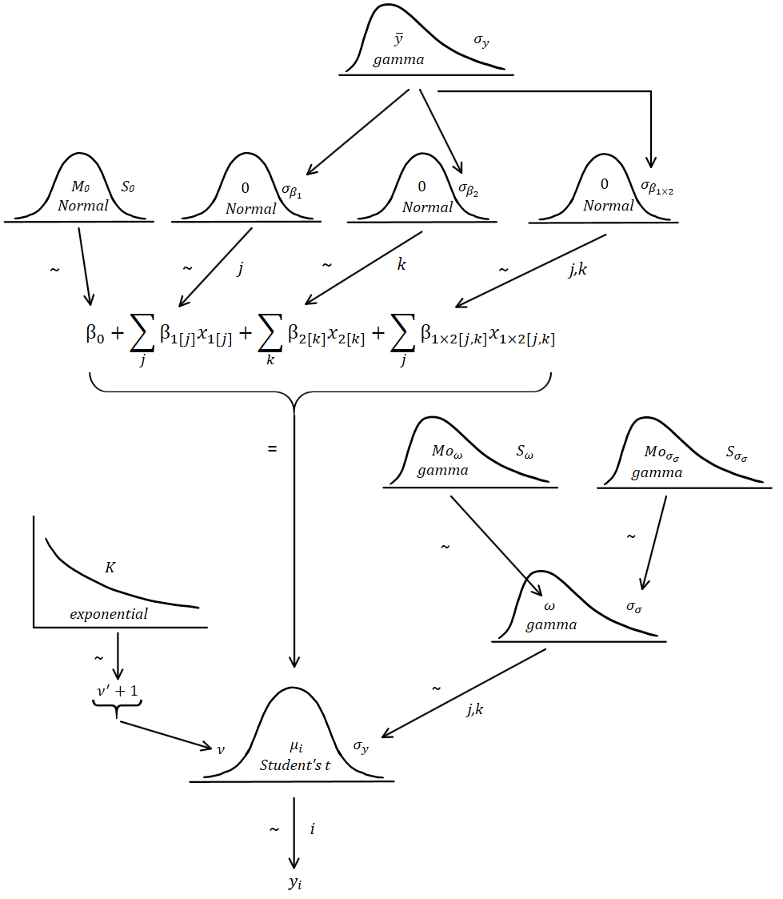

## Data and Packages

```{r, message=FALSE, warning=FALSE, echo=T, results='hide'}

packages <- c("tidyverse",
              "ggplot2",
              "rmarkdown",
              "knitr",
              "kableExtra",
              "purrr",
              "scales",
              "rjags",
              "runjags",
              "coda",
              "readr",
              "beepr",
              "grid",
              "gridExtra",
              "lemon")

lapply(packages, library, character.only=T)

SocialSecPaymentsMar2014 <- read_csv("dsselectoratedatamarch2014flat.csv")

SocialSecLong <- gather(SocialSecPaymentsMar2014, 
                      key="payment_type", value="amount",
                      -c(commonwealth_electoral_division_,
                         commonwealth_electoral_divisio00,
                         state_of_commonwealth_electoral_))


# There are values "<20" in the data set. Changed to simply "20"
SocialSecLong$amount <- replace(SocialSecLong$amount, SocialSecLong$amount=="<20",20)

# sapply(SocialSecLong, class)

SocialSecLong$amount <- as.numeric(SocialSecLong$amount)

# The table contains column totals, so they are removed
SocialSecLong <- filter(SocialSecLong, state_of_commonwealth_electoral_!="Total")

colnames(SocialSecLong)[1] <- "Commonwealth_Electoral_Division_No."
colnames(SocialSecLong)[2] <- "Commonwealth_Electoral_Division_Name"
colnames(SocialSecLong)[3] <- "State"

```

```{r, echo=TRUE, fig.height=9, fig.width=10, message=FALSE, warning=FALSE}

maxamount <- max(SocialSecLong$amount)

ggplot(SocialSecLong) +
  geom_histogram(na.rm=T,
                 aes(x=amount),
                 bins=40,
                 col="white",
                 fill="skyblue4") +
  theme_minimal() +
  labs(title="Histogram of Payment Amounts",
       subtitle="(Likelihood Distribution)",
       y="Frequency", x="Payment Amount") +
  geom_label(x=maxamount*0.9, y=250,
             label=paste("Maximum =",maxamount))

SocialSecLong$payment_type <- as.factor(SocialSecLong$payment_type)

ggplot(SocialSecLong)+
  geom_boxplot(na.rm=T,
              aes(x=payment_type, y=amount),
              col="grey40",
              fill="seagreen1") +
  coord_flip() +
  labs(title="Distributions of Payment Amounts by Payment Type",
       x="Payment Type", y="Amount") +
  scale_x_discrete(limits=rev(levels(SocialSecLong$payment_type))) +
  theme_minimal()

ggplot(SocialSecLong)+
  geom_boxplot(na.rm=T,
              aes(x=State, y=amount),
              col="grey40",
              fill="darkslategray2") +
  coord_flip() +
  labs(title="Distributions of Payment Amounts by State",
       x="State", y="Amount") +
  theme_minimal()

```

```{r, echo=TRUE, fig.height=18, fig.width=10, message=FALSE, warning=FALSE}

SocialSecLong$Commonwealth_Electoral_Division_Name <- as.factor(SocialSecLong$Commonwealth_Electoral_Division_Name)

ggplot(SocialSecLong)+
  geom_boxplot(na.rm=T,
              aes(x=Commonwealth_Electoral_Division_Name, y=amount),
              col="grey40",
              fill="lightgoldenrod1") +
  coord_flip() +
  labs(title="Distributions of Payment Amounts by Commonwealth Electoral Division",
       caption="(Also referred to as Federal Electoral Division)",
       x="Payment Type", y="Amount") +
  scale_x_discrete(limits=rev(levels(SocialSecLong$Commonwealth_Electoral_Division_Name))) +
  theme_minimal()

```

## Assumption of Normality Within Groups

It appears as though Payment Type might be normally distributed within groups. State and Electoral Division appear to not be normally distributed, and appear to be positively skewed. The data table used is a summary table of all payments made within the year 2014. As such, it can be assumed that the underlying distributions within groups is substantially large.

## Homogeneity of Variance Within Groups
The levels within the groups `payment_type` and `Commonwealth_Electoral_Division_Name` do not appear to have the same variance throughout. Luckily, the adaption of a robust model to account for violations to this assumption of MANOVA are easily adaptible.


## Bayesian Model and Hypothesis

Whilst the data table contains all payments made within the year to March 2014, this data can be used to model what payments will be incurred in the future. As Commonwealth Electoral Divisions can only belong to one state, using *both* Commonwealth Electoral Division and State in the model would be redundant and likely cause multicollinearity. As such, the model becomes a **Bayesian Multiple Analysis of Variance** over two nominal predictor variables. The general model for MANOVA is:

$$\mu= \beta_0 + \overrightarrow{\beta_1} \cdot \overrightarrow{x_1} + \overrightarrow{\beta_2} \cdot \overrightarrow{x_2} + \overrightarrow{\beta_{1\times2}} \cdot \overrightarrow{x_{1\times2}}$$

$$\mu= \beta_0 + \sum_j{\beta_{1[j]}x_{1[j]}} + \sum_k{\beta_{2[k]}x_{1[k]}} + \sum_{j,k}{\beta_{1\times2 [j,k]}x_{1\times2[j,k]}} $$

Which can be modelled diagramatically as:



### Prior Knowledge and Distributions


The data set was not provided with any prior knowledge or expectations for the distributions of the predictor variables. However, it can be assumed that "deflections"$^1$ of each predictor are centred around a mean of 0. The prior distribution of the spread of the predictor variables also cannot be estimated, however it can be predicted from the likelihood distribution of the sample.
<br /> <br />

$1$: can also be thought of as deviations


```{r, message=FALSE, warning=FALSE, include=FALSE}

write.csv(SocialSecLong,
          file="SocialSecLong.csv",
          row.names = F)

# The model doesn't work with NA, so NAs will be removed

SocialSecNA.RM <- filter(SocialSecLong, !is.na(`Commonwealth_Electoral_Division_No.`))

write.csv(SocialSecNA.RM,
          file="SocialSecNA.RM.csv",
          row.names = F)

SocialSecNA.RM$dupe <- SocialSecNA.RM$Commonwealth_Electoral_Division_No.


```

### Selecting Contrasts

This is arbitrary. However, it appears that  `family_tax_benefit_a`, `family_tax_benefit_b`, and `healthcare_card` have similarly distributed payment amounts. Payment amounts amongst all of the levels in `Commonwealth_Electoral_Division` appear to be quite similar. As such, the following electorates (all from the Greater Melbourne area$^2$) will be selected to contrast: `Melbourne`, `Kooyong`, `Higgins`, `Gellibrand`.


2: See https://www.aec.gov.au/Elections/federal_elections/2016/files/vic-results-map-2016.pdf for more.


## Model and Data Block

Considering all the above, the data and model block for the JAGS simlation can be specified as follows:

```{r}


```


